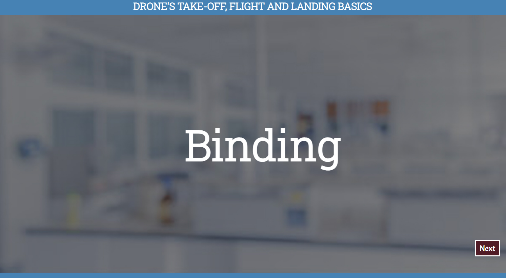
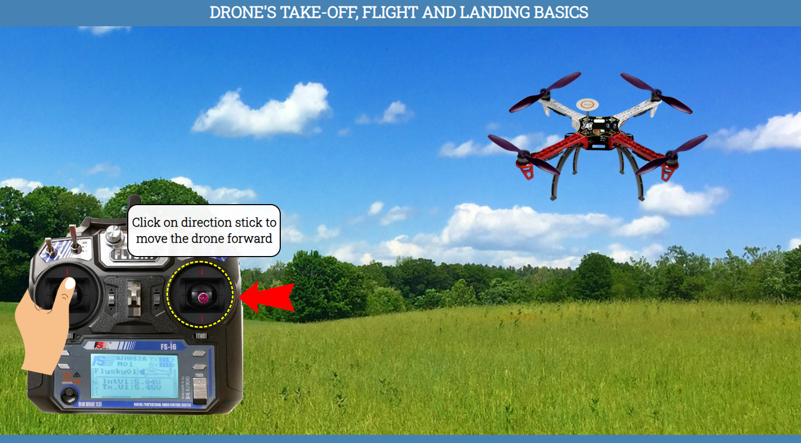

### Procedure

### Drone's Take-off, Flight & Landing Basics

#### Click Here to Enter the Lab
#### 

#### Click the next button
#### 
<!--
### Precautions

#### 1. No cell phone or ear phone usage in the laboratories.

#### 2. Know locations of laboratory safety showers, eyewashstations, and fire extinguishers.

#### 3. Determine the potential hazards before beginning any work.

#### 4. Avoid wearing jewellery in the lab as this can pose multiple safety hazards.

#### 5. Long hair and loose clothing must be pulled back and secured.

#### 6. Avoid contact with energized electrical circuits.

#### 7. Do not touch anything if your hands are wet. The "one-hand" approach is safest.

#### 8. Do not make circuit changes or perform any wiring when power is on.

#### 9. All equipment should be regularly inspected for wear or deterioration.

#### 10. Know emergency exit routes.
-->

#### Click the next button
#### 

#### Click on binding button, keep pressing it and click on power button
#### 

#### Click on binding button, keep pressing it and click on power button
#### 

#### LED light is not blinking here, that means your binding is successfully completed
#### 

#### Click on the power button of transmitter to turn it off
#### 

#### Click the next button
#### 

#### Test Your Memory
#### Choose the option and click on the submit button
#### 

#### Click the next button
#### 

#### Click the next button
#### 

#### Drag LED wire and fix it with the LED port of NAZA flight controller
#### 

#### Click on the power button of transmitter
#### 

#### Click on GPS stick of transmitter 10 times to observe the LED colour
#### 

#### If LED light is yellow then you have to rotate the drone horizontally
#### 

#### Click on drone to rotate it horizontally
#### 

#### If LED colour is blinking then you have to rotate the drone vertically
#### 

#### Click on drone to rotate it vertically
#### 

#### Click on the power button of transmitter to turn it off
#### 

#### Click the next button
#### 

#### Test Your Memory
#### Choose the option and click on the submit button
#### 

#### Click the next button
#### 

#### Click the next button
#### 

#### Click on transmitter screen for zoom view
#### 

#### Click on the power button of transmitter
#### 

#### Long press OK button
#### 

#### To select system option click on OK button
#### 

#### To select Model select option click on OK button
#### 

#### To select Model 1 long press Cancel button
#### 

#### Click on down button to go on Model name option
#### 

#### To select Model name click on OK button
#### 

#### By default blysky is given as a model name, to update modle name as flysky click Up button till letter F will be highlighted
#### 

#### To save updated model name flysky long press Cancel button
#### 

#### Click on down button to go on Type select option
#### 

#### To select Type select option click on OK button
#### 

#### Click on down button to change the model type
#### 

#### To save Airplane or glider long press Cancel button
#### 

#### Click on down button 3 times to go on RX Setup
#### 

#### To select RX Setup option click on OK button
#### 

#### To select AFHDS 2A option click on OK button
#### 

#### Click on down button to ON AFHDS 2A
#### 

#### To save changes long press Cancel button
#### 

#### Click on down button 3 times to go on Failsafe option
#### 

#### To select Failsafe option click on OK button
#### 

#### To select Channel1 click on OK button
#### 

#### Click on down button to ON channel 1
#### 

#### To save changes long press Cancel button
#### 

#### Repeat the same process with other channels

#### To select Channel2 click on OK button

#### Click on down button

#### To turn on channel 2 long press Cancel button

#### Click on down button to go on channel3

#### To select Channel3 click on OK button

#### Click on down button

#### To turn on channel 3 long press Cancel button

#### Click on down button to go on channel4

#### To select Channel4 click on OK button

#### Click on down button

#### To turn on channel 4 long press Cancel button

#### Click on down button to go on channel5

#### To select Channel5 click on OK button

#### Click on down button

#### To turn on channel 5 long press Cancel button

#### Click on down button to go on channel6

#### To select Channel6 click on OK button

#### Click on down button

#### To turn on channel 6 long press Cancel button

#### Long press Cancel button to save all the channels
#### 

#### Click on the power button of transmitter to turn it off
#### 

#### Click the next button
#### 

#### Test Your Memory
#### Choose the option and click on the submit button
#### 

#### Click the next button
#### 

#### Click the next button
#### 

#### Click on the power button of transmitter
#### 

#### Place all switches in their up position and lower the throttle

#### All switches are already in up position, click on throttle to place it lower position
#### 

#### To arm the drone click on throttle or pitch
#### 

#### Click on throttle to move it upward for take off
#### 

#### Note: After take off, continue moving the throttle up and down little bit to hold the drone in same position
#### Click the next button
#### 

#### Test Your Memory
#### Choose the option and click on the submit button
#### 

#### Click the next button
#### 

#### Click the next button
#### 

#### Click on direction stick to move the drone left side
#### 

#### Click on direction stick to move the drone right side
#### 

#### Click on direction stick to move the drone forward
#### 

#### Click on direction stick to move the drone back
#### 

#### Click on the throttle to rotate the drone anti-clockwise
#### 

#### Click on the throttle to rotate the drone clockwise
#### 

#### Click the next button
#### 

#### Test Your Memory
#### Choose the option and click on the submit button
#### 

#### Click the next button
#### 

#### Click the next button
#### 

#### Click on the throttle to move it downward for landing
#### 

#### To disarm the drone click on throttle or pitch
#### 

#### Remove the battery wire from the male socket of deans plug
#### 

#### Click on the power button of transmitter to turn it off
#### 

#### Click the next button
#### 

#### Thank You For Performing the Experiment
#### 
