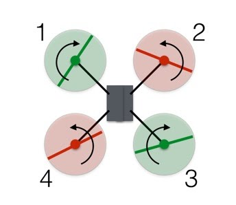

### Theory

### Flying:

When learning how to fly a drone, the controls will become second nature once you know how they operate and interact together to form a complete flying experience.

When you first start out, push the sticks very gently so the drone performs slight movements. As you get more comfortable, you can make sharper movements.

(Note: For simplicity’s sake, this article assumes that the left stick controls yaw and throttle, and the right stick controls roll and pitch. Some transmitters allow the pilot to switch these controls based on what’s most comfortable.)

There are four main drone controls:

#### Roll: Done by pushing the right stick to the left or right. Literally rolls the drone, which maneuvers the drone left or right.</li>

#### Pitch: Done by pushing the right stick forwards or backward. Tilts the drone, which maneuvers the drone forwards or backward.</li>

#### Yaw: Done by pushing the left stick to the left or to the right. Rotates the drone left or right. Points the front of the copter in different directions and helps with changing directions while flying.

#### Throttle: To increase, push the left stick forwards. To decrease, pull the left stick backward. This adjusts the altitude, or height, of the drone. 

Let’s go through each of them.

### Roll (Right Stick)

Roll moves your drone left or right. It’s done by pushing the right stick on your controller to the left or to the right.

It’s called “roll” because it literally rolls the drone. 

For example, as you push the right stick to the left, the drone will angle diagonally downwards to the left. 

When you push the stick to the left, the propellers will be pushing air to the right, forcing the drone to fly to the left.

If the right stick is pulled backward, the front of the drone will pitch up causing the air to push the drone backward. 

### Pitch (Right Stick)

Pitch is done by pushing the right stick on your controller forwards or backward. This will tilt the drone, resulting in forwards or backward movement.

When the right stick is pushed forward, the back of the drone will pitch up causing the air to push the drone forward.If the right stick is pulled backward, the front of the drone will pitch up causing the air to push the drone backward.

### Yaw (Left Stick)

Essentially, it rotates the drone clockwise or counterclockwise.

This is done by pushing the left stick to the left or to the right. 

Yaw is typically used at the same time as throttle during continuous flight. This allows the pilot to make circles and patterns. It also allows videographers and photographers to follow objects that might be changing directions.

### Throttle (Left Stick)

Throttle gives the propellers on your drone enough power to get airborne. When flying, you will have the throttle engaged constantly.To engage the throttle, push the left stick forward. To disengage, pull it backwards. 

Make sure not to disengage completely until you’re a couple of inches away from the ground. Otherwise, you might damage the drone, and your training will be cut short.

  
### Important Note:</u></strong>   
When the drone is facing you (instead of facing away from you) the controls are all switched.  

#### This makes intuitive sense…

1. Pushing the right stick to the right moves the drone to the right (roll)
2. Pushing the right stick forward moves the drone forward (pitch)
3. Pushing the right stick backward moves the drone backward (pitch)
4. And so on.

So pay attention to that as you start changing directions. Always be thinking in terms of how the drone will move, rather than how it is oriented towards you.

### Agricultural drone:

Most general use of drones is to make simple videos and for fun flying . Drones are quite popular these days, and you can get a nice one without spending too much money. Oh, We are talking about the remotely controlled flying vehicles with four rotors, not the bigger drones scientists use to study climate change and stuff. Those cost a lot of money.  

Small drones like we have developed are easy to fly a skilled pilot can hover and fly in just about any direction, which makes them great for recording video. But how does a drone actually fly? Ah, this is an excellent opportunity to look at some physics.  

### Vertical Motion

Drones use rotors for propulsion and control. You can think of a rotor as a fan, because they work pretty much the same. Spinning blades push air down. Of course, all forces come in pairs, which means that as the rotor pushes down on the air, the air pushes up on the rotor. This is the basic idea behind lift, which comes down to controlling the upward and downward force. The faster the rotors spin, the greater the lift, and vice-versa.

Now, a drone can do three things in the vertical plane: hover, climb, or descend. To hover, the net thrust of the four rotors pushing the drone up must be equal to the gravitational force pulling it down. Easy. So what about moving up, which pilots call climbing? Just increase the thrust (speed) of the four rotors so that there is a non-zero upward force that is greater than the weight. After that, you could decrease the thrust a little bit---but there are now three forces on the drone: weight, thrust, and air drag. So, you will still need for the thrusters to be greater than for just a hover.  

Descending requires doing the exact opposite: Simply decrease the rotor thrust (speed) so the net force is downward.  

### Turning (Rotating)

Let's say you have a hovering drone pointed north and you want to rotate it to face east. How do you accomplish this by changing the power to the four rotors? Before answering, I will draw a diagram of the rotors (viewed from above) labeled 1 through 4. 
 

  
In this configuration, the red rotors are rotating counterclockwise and the green ones are rotating clockwise. With the two sets of rotors rotating in opposite directions, the total angular momentum is zero. Angular momentum is a lot like linear momentum, and you calculate it by multiplying the angular velocity by the moment of inertia. Wait. What is the moment of inertia? It is similar to the mass, except it deals with rotation. Yes, it gets rather complicated, but all you need to know is that the angular momentum depends on how fast the rotors spin.  

If there is no torque on the system (the system here being the drone), then the total angular momentum must remain constant (zero in this case). Just to make things easier to understand, I will say the red counterclockwise rotors have a positive angular momentum and the green clockwise rotors have a negative angular momentum. I'll assign each rotor a value of +2, +2, -2, -2, which adds up to zero (I left off the units).  

Let's say you want to rotate the drone to the right. Suppose I decrease the angular velocity of rotor 1 such that now it has an angular momentum of -1 instead of -2. If nothing else happened, the total angular momentum of the drone would now be +1. Of course, that can't happen. So the drone rotates clockwise so that the body of the drone has an angular momentum of -1. Boom. Rotation.  

But wait! Decreasing the spin of rotor 1 did indeed cause the drone to rotate, but it also decreased the thrust from rotor 1. Now the net upward force does not equal the gravitational force, and the drone descends. Worse, the thrust forces aren't balanced, so the drone tips downward in the direction of rotor 1. Don't worry. We can fix this.  

To rotate the drone without creating all those other problems, decrease the spin of rotor 1 and 3 and increase the spin for rotors 2 and 4. The angular momentum of the rotors still doesn't add up to zero, so the drone body must rotate. But the total force remains equal to the gravitational force and the drone continues to hover. Since the lower thrust rotors are diagonally opposite from each other, the drone can still stay balanced.  

### Forwards and Sideways

What is the difference between moving forward or backward? None, because the drone is symmetrical. The same holds true for side-to-side motion. Basically a quadcopter drone is like a car where every side is the front. This means that explaining how to move forward also explains how to move back or to either side.

In order to fly forward, I need a forward component of thrust from the rotors. Here is a side view (with forces) of a drone moving at a constant speed.
 

  	  
How do you get the drone into this position? You could increase the rotation rate of rotors 3 and 4 (the rear ones) and decrease the rate of rotors 1 and 2. The total thrust force will remain equal to the weight, so the drone will stay at the same vertical level. Also, since one of the rear rotors is spinning counterclockwise and the other clockwise, the increased rotation of those rotors will still produce zero angular momentum. The same holds true for the front rotors, and so the drone does not rotate. However, the greater force in the back of the drone means it will tilt forward. Now a slight increase in thrust for all rotors will produce a net thrust force that has a component to balance the weight along with a forward motion component.

### Using a Computer

By now, you've surely noticed that every movement is accomplished by changing the spin rate of one or more rotors. Doing that simply requires a controller that can increase or decrease the voltage to each motor. That's not too difficult to set up. But just imagine this you have a drone with 4 controllers. You'd need one controller for each motor power level. It would be crazy difficult to manually adjust each motor power to achieve the desired motion.

However, if you have some type of computer control system, you can simply push a joystick with your thumb and let a computer handle all of that. An accelerometer and gyroscope in the drone can further increase the ease and stability of flight by making minute adjustments in the power to each rotor. Add a GPS system and you can pretty much get rid of the human entirely. So you can see that flying a drone is pretty easy if you let the computer do all the work. But it's still nice to understand the physics behind it.
